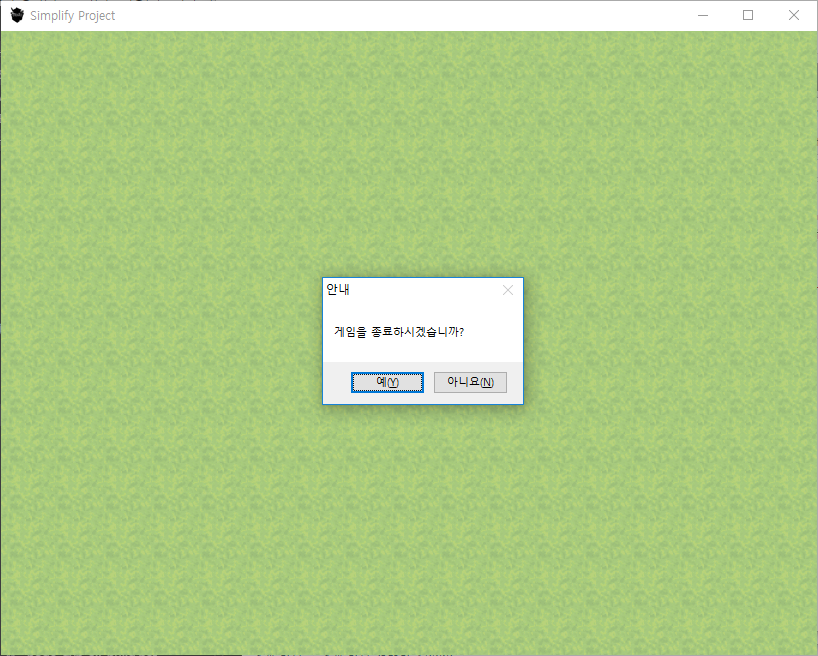
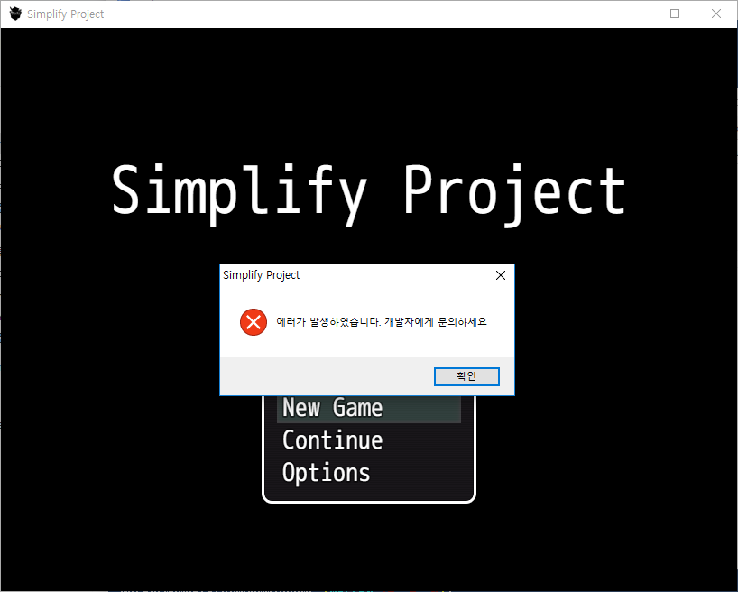

# Descriptions


The preceding screenshot shows the message box such as RPG Maker VX Ace. These functions simply create the message box and check which of the button is clicked. put this script in your game's script command.

```javascript
// In RPG Maker MV 1.6.0 version or above, it can use 'nw' instead of require('nw.gui')
var gui = nw.Window.get();

// This callback function listens for the exit button being pressed.
gui.on('close', function() {

    var ret = RS.MSGBOX.yesno("안내", "게임을 종료하시겠습니까?");
    var iconType = RS.MSGBOX.MB_TYPE.MB_OK | RS.MSGBOX.MB_TYPE.MB_ICONINFORMATION;
    if(ret) {
        RS.MSGBOX.open("안내", "예(YES) 버튼을 눌렀습니다.", iconType);
        this.close(true);
    } else {
        RS.MSGBOX.open("안내", "아니오(NO) 버튼을 눌렀습니다.", iconType);
    }

});
```



if you might want to create the message box simply, you will check these belows.

```javascript

// The title of message box is set as a game title automatically.
Utils.errorMsg("에러가 발생하였습니다. 개발자에게 문의하세요");

Utils.yesno("Do you want to download the help file?", function() {
    // this callback function listens for the 'yes' button being pressed.
}, function() {
    // this callback function listens for the 'no' button being pressed.
});
```

These functions simply create or read an INI file in Windows OS.

```javascript
RS.INI.writeString("Font", "size", "28", "./font.ini");
var fontSize = RS.INI.readString("Font", "size", "./font.ini");

// Characters with UTF-8 format are also OK.
RS.INI.writeString("폰트 설정", "크기", "28", "./폰트 설정.ini");
var fontSize = RS.INI.readString("폰트 설정", "크기", "./폰트 설정.ini");

```

# How to setup?
Run the file called 'latest.cmd', then the main library will be located at **./bin/v10.0.0-INI-x64.node**

Or you can use prebuilt libraries!

[v10.0.0-INI-ia32.node](https://github.com/biud436/MV/raw/master/Windows/INI/bin/v10.0.0-INI-ia32.node)

[v10.0.0-INI-x64.node](https://github.com/biud436/MV/raw/master/Windows/INI/bin/v10.0.0-INI-x64.node)

if you have the library called *.node already, please place it under your **/js/libs directory** and then
insert the plugin called **"RS_INI.js"** in your Plugin Manager.

# Supports
This plugin works fine only in RPG Maker MV 1.6.1 or above. and then this is just one platform in mind.