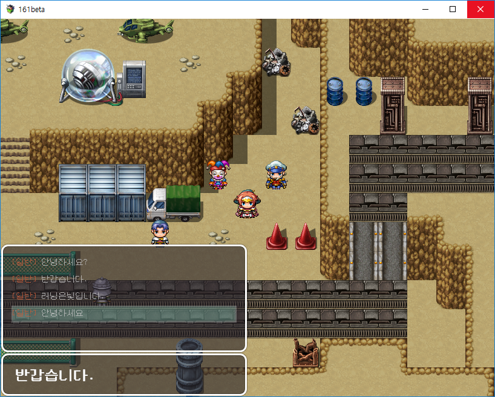

### 소개 ###

한글 조합 및 분해를 할 수 있는 플러그인이다. 

### 스크린샷 ###

### 비고 ###

라이브러리를 사용하면 간단하지만 누구나 한번 쯤은 직접 구현해보는 것 같아서 만들어봤는데 가장 중요한 커서의 위치를 변경할 수 있는 기능이 아직 미완성이다.

직접 코딩하면 단기 기억에서 장기 기억으로 남게 되는 가능성이 높지만, 남이 만들어놓은 것을 편하게 쓰기만 하면 단기 기억의 늪에서 사라진다. 기억이 어떻게 머릿속에 저장되는 지 모르겠지만 키보드를 반복해서 입력하여 몸이 기억하는 건 소뇌, 나머지는 대뇌라고 알고 있다. 해마가 장기 기억으로 바뀌는 데 중요 작용을 하는데, 이게 망각 곡선이 정확히 들어맞는다. 즉, 한 번 만들어봤다고 그만두면 다음에는 또 까먹게 된다.

코딩을 하면서 꼼꼼하게 살펴보지 않는 안좋은 버릇이 생긴 것 같은데 가끔 포럼에 올라오는 버그 리포트를 보면 뜨끔 한다. 내 플러그인에는 수익이 전혀 나지 않지만 솔직히 수익을 바라는 것도 우스운 일이다. 이런 작은 플러그인 하나 만들면서 버그가 많은 것을 보면 나는 코딩을 할 그릇이 못되는 것 같다고 생각된다. 

그럴 수 밖에 없는 게 사실 거의 5년 전 코딩을 시작하면서 많은 책을 구매했고, 또 공부 했다. 족히 20 ~ 30권은 넘는 것 같은데, 그걸 다 읽는다고 고수가 되진 않는다. 거의 모두가 기본서에 가깝고 진짜 코드는 깃허브나 어떤 프로젝트의 소스 코드 같은 곳에 있기 때문이다. 나는 코딩 테스트를 통과 할 자신도 없고, 포트폴리오를 만들면서 생긴 몇 년간의 공백에 대해 물으면 면접장에서 어떻게 설명해야 할 지 잘 모르겠다. 또한 운영체제, 컴파일러 이론, 자료 구조에도 취약하고, 게임 엔진에서 나오는 선형대수학이나 유행하는 알고리즘들을 제대로 연구해본 적도 없다. 게임 회사에 처음 면접을 보고 왔을 때, 내 실력에 충격을 받았지만 지금도 나아진 게 없다. 메일로 코드를 넘겨줬는 데 답변이 없었다. 나는 아직 그걸 잊지 못한다.