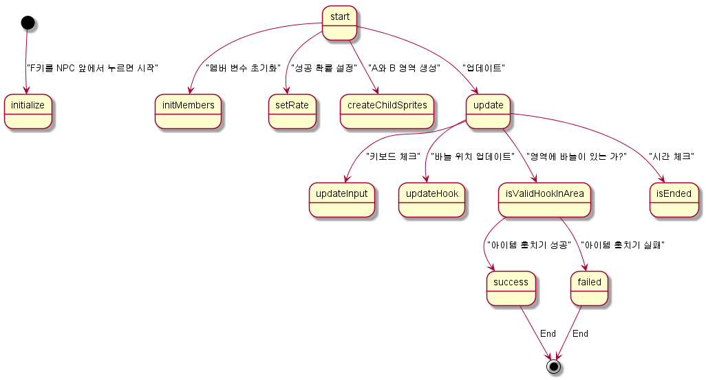

# 1. Member Variables

|Name|Type|Description|
|--|--|--|
|this._state|Boolean|아무것도 안하는 중이면 false, 찾는 중이면 true|
|this._areaA|Sprite|-|
|this._areaB|Sprite|-|
|this._hook|Sprite|-|
|this._successRate|Number(Double)|0.25 ~ 0.75|
|this._timer|Number|초기 값은 0|

# 2. System
# 2.1. 시스템 플로우 차트
    


# 2.2. 상태

|상태|조건|
|--|--|
|훔치기 시작|훔칠 NPC 앞에서 F 버튼을 눌렀는가?|
|훔치기 성공|A 영역 안에 바늘이 있다.|
|훔치기 실패|B 영역 안에 바늘이 있다.|

# 2.3. 레이아웃의 구성

게이지바의 레이아웃은 다음과 같이 A와 B 두 이미지로 구성되어있다. 


Z-인덱스는 다음과 같이 구성된다.

|Z-Index|Name|Size|
|--|--|--|
|1|Rectangle A|200 x 25 px|
|0|Rectangle B|200 x 25 px|

# 2.4. 크기 및 위치 설정

각 스프라이트의 크기는 확률 0 ~ 100에 의해 결정된다.

|이름|초기 위치 설정 방법|초기 비율|
|--|--|--|
|Rectangle A|램덤 함수에 의존|25|
|Rectangle A|램덤 함수에 의존|75|

확률 값이 30% 라면 Rectangle A의 width 값에 0.3을 곱하여 사이즈를 줄인다.

이때, Rectangle A의 x 좌표 값은 0-100으로 측정하면, 0-70 사이여야 한다.

# 2.5. 초침의 진행

초침 바늘은 기본적으로 좌우로 움직인다.

|Object Name|Speed|비고|
|--|--|--|
|바늘| 전체 필드 폭의 2% | 200px 이라면 프레임 당 4px |

결정키를 누르거나 정해진 시간이 지나면 바늘이 제자리에 정지한다.

# 2.6. 훔치기 성공 및 실패

|State|Description|
|--|--|
|성공|A 영역에 초침이 정지|
|실패|B 영역에 초침이 정지|
|시간 초과|4초가 지나면 바늘 초침이 제자리에 정지|

초침이 멈췄을 때, A 스프라이트와 '충돌' 하는 위치에 있다면 훔치기 성공이며, B 스프라이트와 충돌한다면 훔치기 실패이다.

시간 초과 내에 결정키를 누르지 못했을 때 A 스프라이트와 충돌하는 위치라면 훔치기 성공으로 판단한다.

# 2.7. 알림 메시지

|Index|Description|
|--|--|
|Alert0|훔칠 아이템이 없습니다|
|Alert1|훔치기에 실패하였습니다|
|Alert2|훔치기에 성공하였습니다|

# 2.8. NPC 찾기 및 획득

다음은 NPC를 찾는 방법에 대한 코드이다.

```javascript
    /**
     * 매 프레임 실행된다.
     */
    Game_Player.prototype.updateStealing = function() {
        var x2 = $gameMap.roundXWithDirection(x, d);
        var y2 = $gameMap.roundYWithDirection(y, d);
        // $gameMap.eventsXyNt(x2, y2);와 같다.
        var events = this.isCollidedWithCharacters(x2, y2)
        if(events) {
            var initRate = Math.random();
            RS.StealingSystem.start(initRate);
        }
    };
```

와 같이 특정 타일에 있는 이벤트 배열을 가져와 훔치기 시스템을 시작할 수 있다.

# 2.9. 이미 탐색한 NPC 재탐색 불가능 설정
이미 탐색한 오브젝트의 ID 값을 저장해둔다. 

```javascript
    var alias_Game_System_initMembers = Game_System.prototype.initMembers;
    Game_System.prototype.initMembers = function() {
        alias_Game_System_initMembers.call(this);
        this._stealing = [];
    };

    Game_System.prototype.setStolenStuff = function(itemId) {
        var mapId = $gameMap.mapId();
        var id = (mapId * width) + itemId;
        this._stealing[id] = true;
    }; 
```