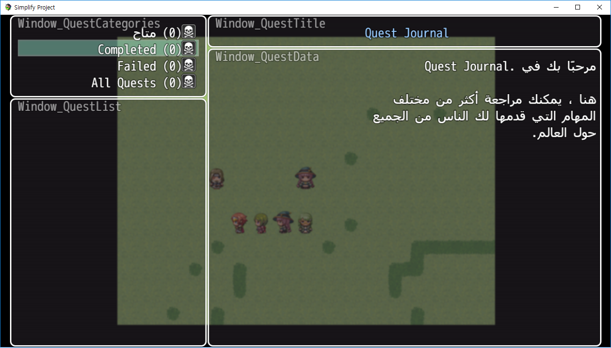

* Arabic Message System (April 5, 2018)

  + April 10, 2018

Quest Journal 플러그인을 오른쪽에서 왼쪽으로 읽는 아랍어 텍스트 규격에 맞게 변환하는 작업.

> 좌우 반전된 레이어를 만들고, 일일히 열거하여 한 번더 추가하면 제대로 보이게 되지만,
>
>
>
> 커스텀으로 정의한 Window_Command나 Window_Selectable에는 잘 대응하지 않으므로 수동으로 수정을 해야 한다.
>
